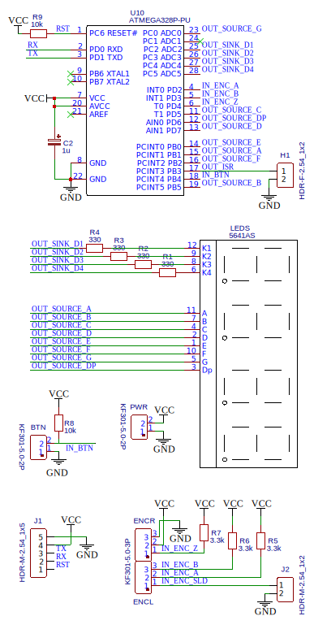
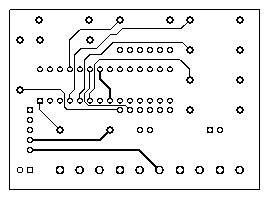
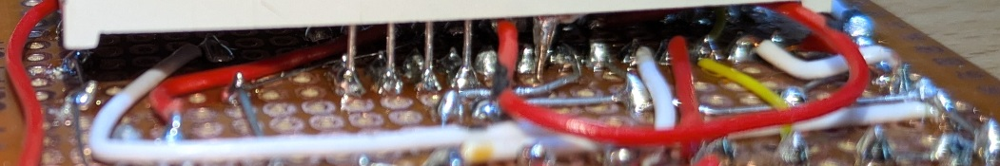

# Arduino Spindle Encoder : Angle/RPM display

This is the design and files for a lathe spindle encoder.

Available functionalities :

- use the lathe's spindle as a **dividing head** for various circular patterns
  - accurate angular positionning with a 0.1 degrees step
  - setting zero by long button press (in angular mode only)
  - optional : absolute encoder mode (requires Z pin on encoder and activating a #define)

- monitor **real spindle speed**
  - real time display in rotation par minute display (RPM)
  - useful in case of a VFD or DC motor or to monitor motor load during work
  - works in forward and reverse

- optional : raw encoder value display

- optional : interrupt service routine timing
  - if enabled, used LED BUILTIN pin by default, configurable
  - currently, on an Arduino UNO, ISR duration is 20 usec (50000x per second)

# Prototypes

## Pinout

| Pin type |    Pin use   | Arduino UNO | Atmega / DIP28 |
|:--------:|:------------:|:-----------:|:--------------:|
|  Output  |   LED A SRC  |      D9     |  PB1 / pin 15  |
|  Output  |   LED B SRC  |     D13     |  PB5 / pin 19  |
|  Output  |   LED C SRC  |      D5     |  PD5 / pin 11  |
|  Output  |   LED D SRC  |      D7     |  PD7 / pin 13  |
|  Output  |   LED E SRC  |      D8     |  PB0 / pin 14  |
|  Output  |   LED F SRC  |     D10     |  PB2 / pin 16  |
|  Output  |   LED G SRC  |      A0     |  PC0 / pin 23  |
|  Output  |  LED DP SRC  |      D6     |  PD6 / pin 12  |
|  Output  |  LED D1 SINK |      A2     |  PC2 / pin 25  |
|  Output  |  LED D2 SINK |      A3     |  PC3 / pin 26  |
|  Output  |  LED D3 SINK |      A4     |  PC4 / pin 27  |
|  Output  |  LED D4 SINK |      A5     |  PC5 / pin 28  |
|  Output  | DEBUG/TIMING |     D11     |  PB3 / pin 17  |
|   Input  |   ENCODER A  |      D2     |   PD2 / pin 4  |
|   Input  |   ENCODER B  |      D3     |   PD3 / pin 5  |
|   Input  |   ENCODER Z  |      D4     |   PD4 / pin 6  |
|   Input  |    BUTTON    |     D12     |  PB4 / pin 18  |

## Arduino UNO breadboard prototype

Uses on-board 16 MHz crystal

## Atmega8A (or Atmega328p, or similar...) perfboard

IMPORTANT : Uses on-chip internal 8 MHz oscillator, no on-board crystal.

### Schematic

### Perboard-compatible PCB layout

EasyEDA preview

Top copper layer and through holes

Bottom copper layer and through holes :

If you chose to order PCBs from any manufacturer, just keep the display as **last** thing to solder

### Perfboard soldering

General hints

- Start by placing the microcontroller socket, with "pin 1 marker" on column `C` and row `8`
- Only solder the microcontroller **non-connected pins** : `9`, `10`, `21`, and `24`
- Then build/prepare all the other links, *except those who connect to the display* :
  - Most of the links are done using the legs of the through-hole components
  - Other links are done reusing old (saved) through-hole component legs
  - In these case, the legs were shaped to fit and pre-tacked on one side
  - A couple were made using solid core AWG 34 (0.2 mm2) wire-wrapping + solder
  - But it could have been done like all the remaining AWG 20 (0.5mm2) solid core
  - The most difficult solder joints are the last ones for the display over the socket
  - Where traces overlapped, i either used insulated wire or small heat-shrink over pre-pinned wire

Here is the soldering order i followed, from `(1)` to `(74)` :

Special advice for soldering the display :

- Print the **horizontal-flip** of the PCB (plated holes side), to use as a soldering work sheet
- The perfboard i use is single sided, without plated holes, so no continuity anywhere
- The display is placed *above* the previous soldered joints, so no access afterwards
- For most, i prepared short straight "old-led-legs wires", soldered from socket pins **outwards**
- For a few, i pre-looped and soldered solid-core 20 AWG jumper **to the top** of the display legs
- Finally, i loop/soldered a jumper from pin 23 (mark 51) and looped/soldered it to mark 59
- I placed the display and check that prepared "legs" were bent enough to actually touch display pins
- I checked all display pins again 3 times, because once started, there was no coming back !
- I placed "in the air" and level, with pins barely going past the top side (for later testing)
- I finally soldered marks 64-70, in a "hail mary" style, then finished the floating jumper cables

Verification :

- Print another PCB imagecopy, but this time on the **top side** to verify connections
- Test **all** connections for continuity : all should be less than 1 ohm
- Once the capacitor is soldered between `VCC` and `GND`, you have increasing Mohm resistance between them

Soldering duration

- it took me 4-6 hours to plan and do it all because i like to take my time
- start some peaceful music and enjoy the process, so you can work steadily
- after a point, there is no second chance, better do it right the first time
- prepare every joint and leg the best it could be, that is good practice
- any training on "unimportant" stuff, ensures a safer ride when "it gets difficult" later.

Here are some picture of the final result :

And i you do not feel like doing it, are not in a rush, or want to get pretty things, order a PCB !

## How to connect the board

If you chose to **order PCBs** from any manufacturer

- the labels will be printed on the silkscreen

If you **soldered a perfboard** yourself (one with letters on the long side):

- print, cut and laminate the [connection card](perfboard-connection-card.odt) (LibreOffice document)

- screwn terminals
  - `letter W` : power supply = **5V DC**
  - `letter U` : power supply = GND
  - `letter S` : button : single pole single throw (SPST) normally-open (NO)
  - `letter Q` : button : same as above, other leg
  - `letter O` : quadrature encoder : ground (forwarded *on-board* from `U`)
  - `letter M` : quadrature encoder : power (**5V DC** forwarded *on-board* from `W`)
  - `letter K` : quadrature encoder : output Z (once per turn)
  - `letter I` : quadrature encoder : output B (N per turn, phased from A)
  - `letter G` : quadrature encoder : output A (N per turn)
  - `letter E` : quadrature encoder : cable shield

- `J2` connector : male pin headers for encoder shield grounding
  - `letter C/B` : optional **jumper** `J2`

- `J1` connector : male pin headers for UART ICP (conn)
  - `row 08` : microcontroller `RESET` pin (see [Requirements](#requirements) for notes about capacitor)
  - `row 07` : microcontroller `RX` pin
  - `row 06` : microcontroller `TX` pin
  - `row 05` : microcontroller **5V DC** `VCC`
  - `row 04` : microcontroller `GND`

- `H1` connector : female pin headers for timing/debugging
  - pin on column `U` : signal
  - pin on other column : ground

# Limitations

- display is limited to 4 digits
  - max 9999 RPM then overflow
  - do not use encoders with more than 2000 pulses per revolution
  - 1-digit precision (and display) for angular degrees of rotation

- encoder output bandwitch
  - maximum output frequency is 100kHz for the reference below
  - you choice of PPR must satisfy `RPM * 4 * PPR / 60 < 100_000`
  - because 1 rotation = 4 * number of pulse per revolution = events
  - to chose your encoder PPR, check `desired_RPM * PPR < 1 500 000`

# Components

For this project, you will need :

- 1x **5V DC** Omron E6B2-CWZ6C rotary encoder **with open-collector output**
  - https://www.ia.omron.com/product/item/2453/
  - https://www.ia.omron.com/data_pdf/cat/e6b2-c_ds_e_6_3_csm491.pdf
- MCU
  - **for prototyping** 1x Arduino UNO or any other 5V MCU with enough pins (see requirements below)
  - **for pcb/perfboard** 1x Atmega8A-like MCU and a 28-DIP socket to solder
- 1x 5641AS **Common-Cathode** 4-digit 7-segment display
  - https://www.xlitx.com/datasheet/5641AS.pdf

And see [Bill of materials](BOM.csv) for others components :

- resistors
- capacitors
- headers
- terminals

# Requirements

- Electrical characteristics
  - 5V power supply (adapt the display resistors in case of a 3.3V MCU)
  - Consumes 26 milli-amperes when the Arduino UNO rev3 is powered from Vin @5V

- Pins
  - 12 digital output pins to directly drive the display (8 segments + 4 digits)
  - 1 digital input for the push button
  - and for the encoder :
    - either 3 digital input pins (for the referenced encoder)
    - or 2 if your encoder lacks the "Z/home" pin

- Sketch information :
  - Does not need internal pullups
  - Sketch uses 2700 bytes (8% of the UNO's program space)
  - Global variables use 85 bytes (4% of UNO's memory space)

- UART serial programming via ICP headers :
  - a UART-able bootloader present on chip
  - a 5V USB-to-serial to upload new sketches
  - an ceramic (non polarized) 0.1uF capacitor
    - placed **in between / in series** from DTR/RTS to RESET
    - is **not** included in the schematic and must be added outside if desired
    - this capacitor is **not** required if you can time your reset (i can't, lol)
    - what this capacitor actually does ?
      - transforms the falling *edge* of DTR/RTS to ground,
      - into to a *pulse* to ground viewed from RESET,
      - allowing RESET to raise again to VCC via the pullup on RESET
      - effectively rebooting the MCU when DTR/RTS changes state

# Installation

- Clone the project and open in arduino IDE
- Optional : install `digitalWriteFast` library
  - Uncomment the `USE_FAST_LIBRARY` define at the top of the INO file

- Option 1 : Using an UNO-as-ISP and breadboard schematic
  - use Sketch / Upload using programmer

- Option 2 : install Minicore or better bootloader and fuse management, and upload over serial
  - Follow https://github.com/MCUdude/MiniCore?tab=readme-ov-file#how-to-install
  - Prepare/Configure your board
    - Set Tool / Board / Minicore / Atmega8A (for example)
    - Set Tool / BOD (Brown out detector) to 4.0V
    - Set Tool / Clock / Internal 16MHz
    - Set Tool / Bootloader / Yes (UART 0)
  - Using an UNO-as-ISP and breadboard schematic
    - use Tool / Burn bootloader (and fuses)
  - Using an USB-to-serial adapter, a breadboard montage, and an non-polarized RESET cap
    - use Sketch / Upload
